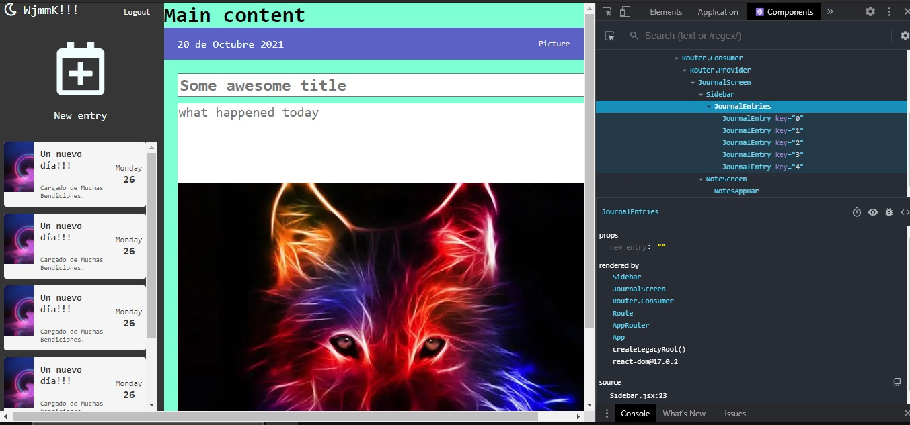

# Getting Started with Create React App

This project was bootstrapped with [Create React App](https://github.com/facebook/create-react-app).
And Authentication is implemented with Firebase 9.0

## Available Scripts

In the project directory, you can run:

### `yarn start`

Runs the app in the development mode.\
Open [http://localhost:3000](http://localhost:3000) to view it in the browser.

### `Description`

This is an application that controls the daily events of any user; based on small notes, which allow you to jot down all the important activities that you need to consider.

